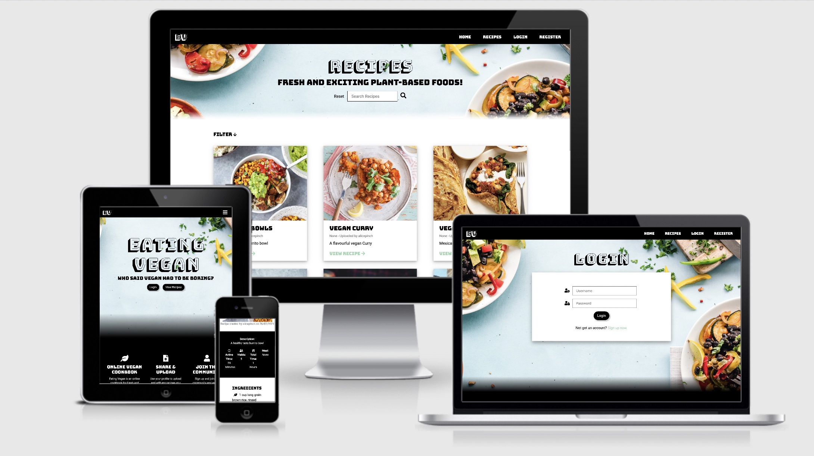

# Eating Vegan

[Eating Vegan Live Site](https://eatingvegan.herokuapp.com/)



Eating Vegan is an online community where users can create and explore new exclusively vegan recipes with each other. Users of "Eating Vegan" will have the option to create an account where they will be able to login to create, read, update and delete Vegan recipes. 

## Table of Index: 
- [UX](#ux)
   - [User Stories](#user-stories)
   - [Wireframes](#wireframes)
   - [Design](#design)
- [Features](#features)
- [Future Features](#future-features)
- [Security Features](#security-features)
- [Technologies Used](#technologies-used)
- [Data Schema](#data-schema)
- [Testing](TESTING.md)
- [Deployment](#deployment)
   - [Github cloning](#creating-a-local-repository)
   - [Heroku deployment](#heroku-deployment)
- [Credits](#credits)
 
## UX

The UX goal of this website is to build a fun, easy to use website for users to share and view Vegan recipes all in one place.

### Target Audience

Eating vegan's main target audience is Vegan's who want to get inspiration for what to cook for breakfast, lunch, dinner or dessert and those who want to share their own recipes.
Another target audience for Eating Vegan is those people who want to explore veganism, see what different food options are out there and what they can make themselves.

### User Goals: 

- To be able to easily create a new recipe.
- To be able to edit the recipe if something has changed/ was added incorrrectly.
- To easily be able to delete a recipe if they no longer want to share with others.
- To easily delete their account if they no longer want to be part of the community.

### Site Owner Goals

- Ensure that the interface is clear and easy to use for those users who want to create an account and actively engage with the content.
- To provide users with a space they can easily create, edit and delete recipes for the website in one place.
- For the admin to easily make any adjustments/delete any recipes on the website if needed.
- To increase awareness of how good vegan food can be!
- Provide breakfast, lunch, dinner and dessert options for users to decide what they want to eat/cook.

## User Stories

<details><summary>Registered User</summary>
<p>

- As a user I would like to be able to login to my account.
- As a user I would like to be able to log out of my account.
- As a user I would like to be able to view my profile.
- As a user I would like to be able to create new recipes.
- As a user I would like to be able to view all recipes in one place.
- As a user I would like to flick through the different meal types.
- As a user I would like to be able to search through all recipes.
- As a user I would like to be able to edit recipes that I have created.
- As a user I would like to be able to remove recipes that I have created.
- As a user I would like to be able to sign up for the newsletter.
- As a user I would like to be able to update my password.
- As a user I would like to be able to delete my account.
- As a user I would like to be able to update my profile photo.
- As a user I would like to be able to save recipes to my profile.
- As a user I would like to be able to remove saved recipes from my profile.

</p>

</details>

<details><summary>New User</summary>
<p>

- As a new user I would like to be able to register an account.
- As a new user I would like to be able to sign up for the newsletter.
- As a new user I would like to be able to understand what the website is.

</details>


## Wireframes

Wireframes for Eating Vegan were created using balsamiq and can be found below.
As the interface will look different for customers who have registered an account and users who are just visiting there are two wireframes of how this will look.

<details><summary>User Logged In</summary>
<p>


</p>
</details>

<details><summary>User Logged Out</summary>
<p>


</p>
</details>

#### Differences from original wireframes:
As you can see from the original wireframes, there are some features that were not implemented/ some design decisions were changed during the build. For example, due to time constraints and more important features, the reviews section was not included on the homepage. On the profile page when a user is logged in, the "{Username} profile" header was removed as this didn't look the best and was not necessary.

## Design 

Veganism can sometimes be associated with being boring. However, for the overall design of this project I wanted it to be modern but with a fun feel throughout for the user.

<details><summary>Typography</summary>
<p>

Font's I have chosen for this project are 'Bungee Shade', 'Bungee' and 'Roboto'. The reason I have chosen these fonts is because I wanted the design of 'Eating Vegan' to be eye catching and I found the Bungee font's stood out from any others. Bungee Shade will be used for all page headings. Bungee for all subheadings and Roboto will be used for all links, p elements and buttons.

</p>
</details>

<details><summary>Colour Scheme</summary>
<p>

The main colour's chosen for the website are black and white. As users are able to upload their own photos for the recipes I wanted to ensure there wouldn't be any major contrasts in colours so opted for black and white. For links and the hover colour for the Navigation bar I chose a green colour. This was due to wanting to include the colour that is mostly associted with veganism but not overusing it on the website. For links and buttons throughout a grey colour has been used as this complimented the black and white well. Lastly, for flash messages on the login, register and update user pages a red colour has been used so that the messages stand out to the customer. Below is the colour palette used:


</p>
</details>

## Data Schema:

### MongoDB

- The database used for this project is an NoSQL database. The database was created using the MongoDB cross-platform document-oriented program.

### Data types

The datatypes that have been used in this project are:
- ObjectId
- String
- Array
    
### Collections in database:

For this project I created a database in MongoDB called vegan_cookbook. Inside of this database I created 4 different collections to be used.

#### Users

| Title | Key in db | form validation type | Data type |
--- | --- | --- | --- 
ID | _id | None | ObjectId 
Name | username | text, `maxlength="15" from python` | string
Email Address | email | email | string
Password | password | text, `maxlength="15" from python` | string
Profile Picture | profile_img | url `pattern="https://.*"`| string
Saved recipes | saved_recipes | n/a | array
Date joined | date_joined | Populated from when user is created | string

#### Recipes

| Title | Key in db | form validation type | Data type |
--- | --- | --- | --- 
ID | _id | None | ObjectId 
Recipe Name | recipe_name | text, `maxlength="35" from python` | string
Meal Name | meal_name | text | string
Recipe Image | img_url | url `pattern="https://.*"` | string
Yield | yield | number | string
Active Time | active_time | text | string
Total Time | total_time | textarea | string
Description | description | textarea, `maxlength="100" from python` | string
Ingredients | ingredients | textarea | string
Method | method | textarea | string
Recommendations | recomendations | text, `maxlength="100" from python` | string
Created By | created_by | Populated from session['user'] | string
Updated By | last_updated_by | Populated from session['user'] | string
Date Created | date_created | Populated from when form is submitted | string

#### Subscribers

| Title | Key in db | form validation type | Data type |
--- | --- | --- | --- 
ID | _id | None | ObjectId 
Subscribers | subscriber_email | email | string

## Features

- [x] Register account
- New users can register an account, once registered user is logged in and session cookie is created
- [x] Login to account
- Existing users can log into their account, creating session cookie
- [x] Personal profile page
- Displays recipes created by user logged in
- [x] Update profile photo 
- Logged in users can update their profile photo on their profile page
- [x] Delete account
- Logged in users can delete their own accounts from profile page (User is prompted to confirm before deletion)
- [x] Add new recipe
- Logged in users can complete the form to add new recipe to website
- [x] Recipe's page 
- Displays all recipes from all users
- [x] Single recipe page
- Displays specific recipe's information to page
- [x] Flash messages
- Displays information, warnings and error messages from backend to user
- [x] Search
- All users can search recipes by name, description, ingredients
- [x] Filter drop down
- All users can filter recipes by Breakfast, Lunch, Dinner and Desserts
- [x] Update password
-  Logged in users can change their password if they know their current password and two new passwords match
- [x] Delete recipe
- Logged in users can delete recipe only if they created it (User is prompted to confirm before deletion)
- [x] Edit recipe
-  Logged in users can complete edit form to update recipe information only if the user created it
- [x] Save Recipes
- Logged in users can save and remove recipes from their saved page which they can access from profile page
- [x] Navigation bar
- All users have a navigation bar, however this looks different to users that are logged in. You can see this in the [Wireframes section](#wireframes)
- [x] Footer   
- All users have the same footer across all pages
- [x] Newsletter subscription
-  All users can submit their emails to receive newsletters in the future
- [x] Contact email
-  All users can email if needed, currently a set up to go through to personal email address (In the future an email would be created for Eating Vegan)
- [x] Admin 
- Admin account can view all the recipes on their profile page and edit/delete any if needed. 
- [x] Error Pages
- 404 page not found, 500 internal server error and 405 method not allowed custom pages which redirect back to homepage
- [x] Responsive design 
- Website is optimized for multiple screen sizes
- [x] Homepage 
- Provides all users with information about the website and how it works

## Security Features:

- Hashed passwords using password hash from the Werkzeug Library to ensure passwords are not compromised and are secure
- Users are forced to create strong passwords from [validation.py](validation.py), password must include on lowercase, uppercase, number and symbol: !@#$%^&*
- App logic checks session cookie matches the user that created recipes or is the admin to allow only them to remove or edit recipes
- Access to delete recipe and edit recipe URL's is prevented for users who have not created the recipe or are not an admin by directing to a 404 page. This is to prevent hackers knowing that the URL is correct
- Access to delete account URL is also restricted to only the user that is logged in at the time to prevent hackers deleting any other users account
- Flask_sslify redirects all incoming requests to https for secure network.
- Login required decorator from Flask Login for some route's so only users logged in with session cookie can enter
- Session times out after 120 minutes to ensure user is not logged in forever
- User must enter their current password before updating password to ensure that this matches the password in database

## Future Features

Below are the future features that I would like to include to improve the website which are currently out of scope.

- [ ] Show more button for recipes (pagination) on profile page and recipes
- [ ] User profiles with option to upload images
- [ ] Automated email when user signs up & subscribe to newsletter(Flask Mail)
- [ ] User could upload an image directly to the website
- [ ] Option to view other users profiles and what they have uploaded
- [ ] More specific filters for recipes
- [ ] User can update their username
- [ ] Active Links for navigation bar
- [ ] Reviews section for recipes
- [ ] Rating system for recipes
- [ ] Admin can view and manage all users as well as recipes
- [ ] Contact form 


## Technologies Used

The site uses a python server backend and MongoDB database. 
 - The [app.py](app.py) file includes the main code for this app including: Flask initialisation, database interface, and app routes.
 - The [validation.py](validation.py) file includes the functions to validate if a user is logged in using the login required decorator as well functions used to check form fields are valid both to be called in [app.py.](app.py)

#### All technologies used:

- JQuery
    - The project uses **JQuery** to simplify DOM manipulation
- Python 3.8.2
  - Used for backend server and linking to MongoDB
- Flask
    * Werkzeug security
    * Flask Login
    * SSLify
- Jinja templating
  - Used to generate HTML from python code and display data to user
- MongoDB
  - Used for the backend database
- HTML
  - The main structure of this website was built using HTML5
- CSS
  - This project was styled using CSS
- Heroku
  - Used to deploy app
- Bootstrap
  - To help create a responsive website
- Git & GitHub
  - Used for version control and to push changed to remote repository


### Other Tools Used

- [Font Awesome](https://fontawesome.com/) 
- [Google fonts](https://fonts.google.com/) 
- [Balsamiq](https://balsamiq.com/) 
- [Gimp](https://www.gimp.org/) 
- [W3Schools](https://www.w3schools.com/) 
- [StackOverflow](https://stackoverflow.com/) 
- [Coloors](https://coolors.co/) 
- [Favicon generator](https://www.favicon-generator.org/) 
- [JShint](https://jshint.com/) 
- [W3cValidator](https://validator.w3.org/)
- Google chrome developer tools.
- [Flask Documentation](https://flask.palletsprojects.com/en/1.1.x/)
- [Video to gif converter](https://ezgif.com/video-to-gif)
- [Tiny PNG](https://tinypng.com/)
- [CSS Formatter](https://www.freeformatter.com/css-beautifier.html)
- [Pep8 Checker](http://pep8online.com/)

## Testing

All the testing carried out for Eating Vegan can be found [here.](TESTING.md)

## Deployment

### Creating a local repository:

In order to run this on your local IDE you need to insure you have the following installed on your machine:

- PIP
- Python
- Git
- You will also need an account on MongoDB 

In order to deploy your own version of this website you will need to clone a local copy of the repository. To do this you need to follow the following steps.

- Click on the 'Code' button next to 'Add a file' when you have opened a repository
- To clone your repository by https:// click on the clipboard icon next to the URL.
- Once you have done this, open the terminal of your own IDE
  - The current directory will need to be changed to where you want your cloned directory.
- Type ```git clone https://github.com/Alicepinch/everything-vegan.git``` into your terminal.

(There are other ways that you can clone a repository and these can be found on the [GitHub docs.](https://docs.github.com/en/github/creating-cloning-and-archiving-repositories))

Once the repository is cloned you will need to ensure that all the packages needed to run this app are installed. To install all packages from requirements.txt file using the following command in terminal.
``` pip3 -r requirements.txt ```

In your local IDE create a file called env.py.
Inside the env.py file create the following environment variables: 

``` 
import os

os.environ.setdefault("IP", "0.0.0.0")
os.environ.setdefault("PORT", "5000")
os.environ.setdefault("SECRET_KEY", `<your_secret_key>`)
os.environ.setdefault("MONGO_URI", "mongodb+srv://<username>:<password>@<cluster_name>-qtxun.mongodb.net/<database_name>?retryWrites=true&w=majority")
os.environ.setdefault("MONGO_DBNAME", `<your_database_name>`)

```

**As some of this information is sensitive, be sure to create a ".gitignore" file and add "env.py"**

### Create a database in MongoDB: 

- Signup or login to your MongoDB account.
- Go to 'Database User' and create a new database user. 
 - This is the username and password that you will include in your 'MONGO_URI' url in the env.py file.
- Create a cluster 
- Once created, click on 'collections' and create a new database.
 - This is the database name that you will need to include in your 'MONGO_DBNAME' in the env.py file.
- Create four collections within your database: recipes, subscribers, users.

### Heroku deployment:

This repository can now be deployed to Heroku:

To deploy this project to Heroku you will need a Heroku acccount.
Once you have an account please follow the below steps. 

1. In Heroku create a new app and set the region to EU. 

2. In your github project create a requirements.txt file using the terminal command ```pip3 freeze —-local > requirements.txt ``` (This is so Heroku can read all of the web apps that have been used in the project)

3. Create a Procfile by typing ```echo web: python app.py > Procfile``` into the terminal.

4. Add all files to github by typing 'git add .' into the terminal to stage all of your files. Then ```git commit -m "<message here>``` to commit the changes ready to be pushed to GitHub.

5. When all your files are ready to be pushed to github, type ```git push``` in the terminal.

6. Back on your Heroku dashboard for your application, go to 'Deploy'.

7. Within this section, scroll down to 'Deployment method' and select 'Connect to GitHub'

8. In the 'Connect to GitHub' section below - search for the github repository name. When you see the repository name click on the 'Connect' button.

9. Confirm the linking of the heroku app to the correct GitHub repository.

10. In the heroku dashboard for the application, click on "Settings" > "Reveal Config Vars".

11. In the fields fill out the following:

| Key | Value |
 --- | ---
DEBUG | FALSE
IP | 0.0.0.0
MONGO_URI | `mongodb+srv://<username>:<password>@<cluster_name>-qtxun.mongodb.net/<database_name>?retryWrites=true&w=majority`
PORT | 5000
SECRET_KEY | `<your_secret_key>`
PERMANENT_SESSION_LIFETIME | timedelta(minutes=120)

## Credits

- [Block Confirm Form Resubmission Javascript Code](https://stackoverflow.com/questions/6320113/how-to-prevent-form-resubmission-when-page-is-refreshed-f5-ctrlr)
- [Modal code inspiration](https://www.w3schools.com/howto/howto_css_modals.asp)
- [Flask error pages](https://flask.palletsprojects.com/en/1.1.x/patterns/errorpages)
- [For view decorators](https://flask.palletsprojects.com/en/1.1.x/patterns/viewdecorators/)
- [For permanent session cookie](https://flask.palletsprojects.com/en/1.1.x/config/)
- [For validating password stated in ](https://stackoverflow.com/questions/41117733/validation-of-a-password-python.)[validation.py.](validation.py)
- [For how to implement flask SSLify](https://github.com/not-kennethreitz/flask-sslify)

### Content

All content on this website has been created for educational purposes only and all rights are reserved to those credited below:

- All recipes and images created by user "alicepinch" have been taken from [BBC goodfood.](https://www.bbcgoodfood.com/)
- Some recipes will have been added by other users and may have been taken from other websites. 

Any issues then please email me at [alicepinch@hotmail.co.uk.](mailto:alicepinch@hotmail.co.uk)

### Media

The photos used on this site were from:

- https://www.pexels.com/
- https://unsplash.com/ 
- https://pixabay.com/
- Google images "Creative commons licenses" images
    - [Background photo used across site](https://www.pexels.com/photo/photo-of-vegetable-salad-in-bowls-1640770/)
    - [Default recipe image](https://www.pexels.com/photo/white-and-black-wooden-blocks-3669638/)
    - [Default profile Picture](https://www.pexels.com/photo/scrabble-tiles-in-blue-ceramic-plate-2377164/)

----

This website is for educational purposed only.

